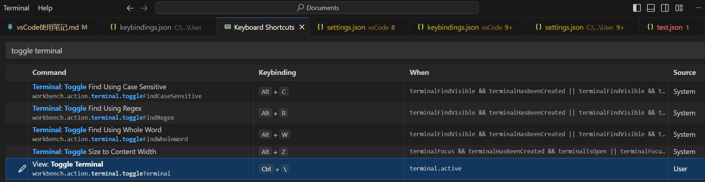

vsCode使用笔记

# 资源
> [官方文档](https://code.visualstudio.com/docs)

# 界面介绍
> [user interface](https://code.visualstudio.com/docs/getstarted/userinterface)

# 配置
> [settings](https://code.visualstudio.com/docs/getstarted/userinterface#_settings)
> [Visual Studio Code: User data directory](https://renenyffenegger.ch/notes/development/editors/Visual-Studio-Code/directories/user-data/index)
> [What is the AppData Folder in Windows 10/11?](https://softwarekeep.com/help-center/what-is-the-appdata-folder-in-windows-10)

Visual Studio Code (VSCode) 提供了灵活的配置系统，允许用户根据自己的需要自定义编辑器的行为和外观。主要的配置文件包括：

1. **settings.json** - 这是VSCode最常用的配置文件，用于存储编辑器设置，如主题、字体大小、自动保存等。这些设置可以在用户级别或工作区级别进行配置。
   - **位置**：
     - 用户设置：`%APPDATA%\Code\User\settings.json` (Windows) 或 `~/.config/Code/User/settings.json` (Linux/Mac)。
     - 工作区设置：在工作区文件夹中的`.vscode/settings.json`。

2. **keybindings.json** - 用于自定义键盘快捷键。用户可以覆盖默认的快捷键或添加新的快捷键绑定。
   - **位置**：
     - 用户快捷键：`%APPDATA%\Code\User\keybindings.json` (Windows) 或 `~/.config/Code/User/keybindings.json` (Linux/Mac)。

3. **launch.json** - 与调试相关的配置文件，用于配置调试会话的参数，比如启动的程序、调试器的路径等。
   - **位置**：位于`.vscode`文件夹内的`launch.json`文件，这个文件夹通常位于项目的根目录中。

4. **tasks.json** - 用于定义项目中的任务，比如编译项目、运行测试等。VSCode可以通过这些定义的任务来执行外部命令。
   - **位置**：跟`launch.json`一样，位于`.vscode/tasks.json`。

5. **extensions.json** - 推荐的插件列表，新加入工作区的成员可以看到推荐安装的插件，便于团队成员保持一致的开发环境设置。
   - **位置**：位于`.vscode/extensions.json`。

这些配置文件让VSCode变得非常灵活，用户可以通过修改这些文件来实现高度个性化的编辑器配置。
可以通过在VSCode中按下`Ctrl + ,`快捷键，或是在命令面板(`Ctrl + Shift + P`)中查找并打开`打开设置(JSON)`来访问`settings.json`文件。
对于其他配置文件，如`keybindings.json`、`launch.json`等，你可以在`.vscode`文件夹中找到它们（如果文件夹或文件不存在，可能需要手动创建）。


## settings.json
> 参考配置：[mirror-vscode](https://github.com/Imymirror/mirror-vscode)
> [settings.json](https://github.com/lxwcd/vsCode/blob/main/settings.json)

期望效果：
- 编辑区域使用 vim 快捷键，尽量和其他地方 vim 快捷键配置一致
- 其他区域自定义快捷键

## 插件
### settings.json 中需要的插件
#### Vim (VSCodeVim)
> [VSCodeVim](https://github.com/VSCodeVim/Vim)

编辑器使用 vim 快捷键

#### Markdown Preview Enhanced 
用于 markdown 预览效果配置的插件
```bash
"markdown-preview-enhanced.previewTheme": "github-light.css",
```

#### Paste Image
粘贴图片的插件
```json
//默认保存路径
"pasteImage.path": "${currentFileDir}/img",
//VSCode 粘贴图片时总是使用 Unix 风格的路径分隔符（即正斜杠/），无论使用的是哪种操作系统
"pasteImage.forceUnixStyleSeparator": true,
//指定图片名前缀
// "pasteImage.namePrefix": "${currentFileNameWithoutExt}-",
//指定图片文件命名中的日期格式
// "pasteImage.dateFormat": "yyyyMMddHHmmss",
//指定图片格式
// "pasteImage.format": "png",
//在粘贴图片时显示文件路径确认输入框
// "pasteImage.showFilePathConfirmInputBox": true
```

在 markdown 文件中，默认快捷键 Ctrl + Alt + v 粘贴图片，格式为：
```markdown
  
```
设置的默认保存路径为当前文件路径，因此会在当前文件中创建 img 文件夹，保存图片。

#### Paste URL
快速粘贴网页链接。
```json
{
   "whichkey.bindings": [
      //paste url extension.pasteURL
      {
         "key": "u",
         "name": "Paste url",
         "type": "command",
         "command": "pasteURL.PasteURL"
      }
   ]
}
```

#### Todo Tree
> [Todo Tree](https://github.com/Gruntfuggly/todo-tree)

#### Which Key (vscode-which-key)
> [vscode-which-key](https://github.com/VSpaceCode/vscode-which-key)

定制其他区域的快捷键

在 normal 模式下，配置按 `[` 打开 which key 命令窗口
```json
{
   //vim normal 模式快捷键绑定
   "vim.normalModeKeyBindingsNonRecursive": [
      // 打开 which key 窗口
      {
         "before": [
               "["
         ],
         "commands": [
               "whichkey.show"
         ]
      }
   ]
}
```

## 配置插件
### Vim

### Which Key

### multi-command
目前未使用该插件的功能。

multi-command是一个VsCode插件，它允许用户将多个命令绑定到单个快捷键上。这意味着您可以通过一次按键执行一系列的操作，从而提高工作效率。这特别有用于那些需要反复执行多步操作的场景。

在`settings.json`文件中，可以定义一个multi-command，包括一个唯一的命令ID和要执行的命令序列。例如，以下配置定义了一个名为`multiCommand.exampleCommand`的命令，它会先保存当前文件，然后显示消息框：
```json
"multiCommand.commands": [
   {
      "command": "multiCommand.exampleCommand",
      "sequence": [
            "workbench.action.files.save",
            "editor.action.clipboardCopyAction",
            "workbench.action.showCommands"
      ]
   }
]
```
**绑定快捷键：**要触发这个multi-command，还需要在`keybindings.json`文件中进行键位绑定。可以通过在命令面板中运行`Preferences: Open Keyboard Shortcuts (JSON)`命令来打开`keybindings.json`文件。然后，添加以下内容来绑定一个快捷键（例如`Ctrl+Alt+M`）到`multiCommand.exampleCommand`：
```json
{
   "key": "ctrl+alt+m",
   "command": "multiCommand.exampleCommand"
}
```
这样，每当按下`Ctrl+Alt+M`的时候，VSCode就会按顺序执行保存文件、复制到剪贴板和展示命令面板的操作。
通过这种方式，multi-command 插件让您能够将多个常用操作组合成一个快捷操作，从而简化工作流程和提高效率。

## markdown 插件
### Markdown All in One
主要提供了Markdown写作时的一些便捷功能，如快捷键、自动预览、生成目录、自动完成列表标记等，旨在提升Markdown文档的编辑效率。

### Markdown Preview Enhanced
更专注于Markdown文档的预览效果，提供了更丰富的预览功能，比如支持渲染更多的Markdown语法、代码高亮、生成幻灯片、图表渲染等。此外，它还支持导出Markdown文件为不同格式的文档。

## pdf 插件
### vscode-pdf
查看 pdf 文档。

## 代码辅助插件
### indent-rainbow
通过为编辑器中的不同缩进级别着色来增强代码的可读性。这个插件通过为每个缩进级别使用一种不同的颜色，帮助开发者更快地识别代码的结构，尤其是在处理嵌套很深的代码块时。

### Todo Tree
在侧边栏中显示项目中的 TODO、FIXME、HACK、XXX、TODO:、FIXME:、HACK:、XXX: 等注释，并支持对注释进行排序、过滤、搜索等操作。

## git 插件
### Gitlens
GitLens是一款广受欢迎的Visual Studio Code插件，它通过超强大的Git功能来增强VS Code的内置Git支持。GitLens主要关注于让你更深入地理解代码，提供了诸多功能来探索和理解Git存储库中的代码是如何、何时以及为什么被改变。

主要特性包括：
- **代码作者信息**：在编辑器中直观显示每行代码的最后编辑者和编辑时间，只需要将鼠标悬停在代码上，就可以看到详细的提交信息。
- **强化的代码比对**：提供了强大的代码比对工具，可以快速比对两个提交之间的差异，或是比对当前文件与任何历史版本之间的差异。
- **提交历史和文件历史查看**：可以查看任何文件或行的提交历史，以及整个项目的提交历史，让你能更好地追踪代码的变动情况。

使用场景：
- **代码审查**：GitLens是代码审查过程中的得力助手，能够快速定位代码更改，了解代码背后的历史。
- **代码追溯**：对于查找代码中引入bug的源头或是理解某个实现的历史背景非常有用。
- **团队协作**：在团队协作的项目中，了解代码更改的上下文和历史变更对于提高开发效率至关重要。

## AI 插件
### TONGYI Lingma
免费，阿里代码辅助插件。

### Tabnine
可以使用免费版，提供基本的代码补全功能。

# CLI 命令
> [The Visual Studio Code command-line interface](https://code.visualstudio.com/docs/editor/command-line)

终端查看 CLI 命令：
```bash
code --help | less
```

|         功能          |            命令             |
| :-------------------: | :-------------------------: |
|   当前窗口打开文件    |      code -r filename       |
| 新窗口打开文件/文件夹 |   code -n filename/folder   |
|     比较两个文件      | code -d filename1 filename2 |

# 快捷键
**keybindings.json** 用于自定义键盘快捷键。用户可以覆盖默认的快捷键或添加新的快捷键绑定。
或者按 ctrl + shift + p 打开命令面板，输入 open keyboard shortcuts 可以选择直接编辑或查看快捷键，或者打开快捷键绑定配置文件 keybindings.json。

## 打开终端 ctrl \
自定义快捷键，不是默认的。


keybindings.json 中的设置：
```json
[
	{ // toggle terminal
		"key": "ctrl+oem_5",
		"command": "workbench.action.terminal.toggleTerminal",
		"when": "terminal.active"
	}
]
```

## 打开命令面板 
### ctrl + shift + p
默认快捷键。

### `[` + c
which key 自定义快捷键。

## 打开 explorer 
### ctrl + shift + e
默认快捷键。

## 切换到 explorer
在 explorer 打开状态，按 ctrl + h。

### `[` + e
可以打开或关闭 explorer，which key 自定义快捷键。

## 返回编辑区
### ctrl + 1
默认快捷键。

### ctrl + shift + c
自定义快捷键

## 打开大纲栏
### `[` + o
自定义 which key 快捷键。

## 切换到大纲栏
### `[` + a
自定义 which key 快捷键。

## 大纲栏中操作
### 上下移动 k|j

### 展开/折叠目录 o

### 新建文件 a

### 新建文件夹 shift + a

### 删除文件 d

