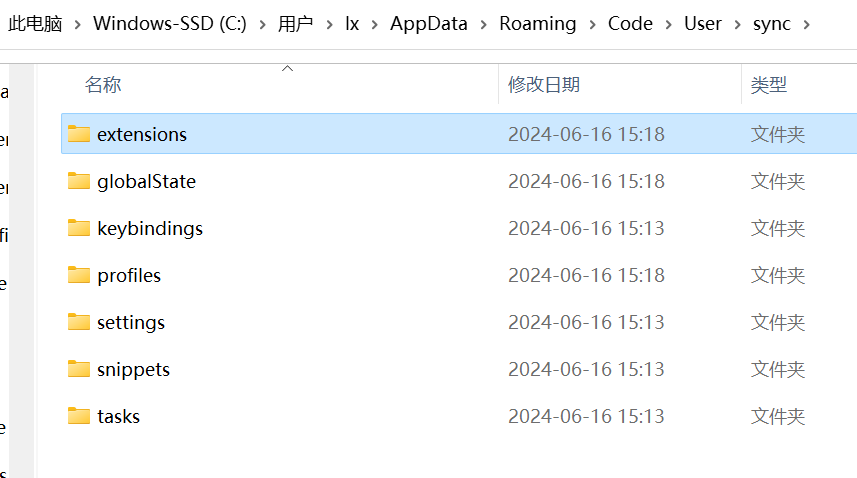

vsCode使用笔记  
  
# 资源  
> [官方文档](https://code.visualstudio.com/docs)  
  
# 界面介绍  
> [user interface](https://code.visualstudio.com/docs/getstarted/userinterface)  
  
# 配置  
> [settings](https://code.visualstudio.com/docs/getstarted/userinterface#_settings)  
> [Visual Studio Code: User data directory](https://renenyffenegger.ch/notes/development/editors/Visual-Studio-Code/directories/user-data/index)  
> [What is the AppData Folder in Windows 10/11?](https://softwarekeep.com/help-center/what-is-the-appdata-folder-in-windows-10)  
  
Visual Studio Code (VSCode) 提供了灵活的配置系统，允许用户根据自己的需要自定义编辑器的行为和外观。主要的配置文件包括：  
  
1. **settings.json** - 这是VSCode最常用的配置文件，用于存储编辑器设置，如主题、字体大小、自动保存等。这些设置可以在用户级别或工作区级别进行配置。  
   - **位置**：  
     - 用户设置：`%APPDATA%\Code\User\settings.json` (Windows) 或 `~/.config/Code/User/settings.json` (Linux/Mac)。  
     - 工作区设置：在工作区文件夹中的`.vscode/settings.json`。  
  
2. **keybindings.json** - 用于自定义键盘快捷键。用户可以覆盖默认的快捷键或添加新的快捷键绑定。  
   - **位置**：  
     - 用户快捷键：`%APPDATA%\Code\User\keybindings.json` (Windows) 或 `~/.config/Code/User/keybindings.json` (Linux/Mac)。  
  
3. **launch.json** - 与调试相关的配置文件，用于配置调试会话的参数，比如启动的程序、调试器的路径等。  
   - **位置**：位于`.vscode`文件夹内的`launch.json`文件，这个文件夹通常位于项目的根目录中。  
  
4. **tasks.json** - 用于定义项目中的任务，比如编译项目、运行测试等。VSCode可以通过这些定义的任务来执行外部命令。  
   - **位置**：跟`launch.json`一样，位于`.vscode/tasks.json`。  
  
5. **extensions.json** - 推荐的插件列表，新加入工作区的成员可以看到推荐安装的插件，便于团队成员保持一致的开发环境设置。  
   - **位置**：位于`.vscode/extensions.json`。  
  
这些配置文件让VSCode变得非常灵活，用户可以通过修改这些文件来实现高度个性化的编辑器配置。  
可以通过在VSCode中按下`Ctrl + ,`快捷键，或是在命令面板(`Ctrl + Shift + P`)中查找并打开`打开设置(JSON)`来访问`settings.json`文件。  
对于其他配置文件，如`keybindings.json`、`launch.json`等，你可以在`.vscode`文件夹中找到它们（如果文件夹或文件不存在，可能需要手动创建）。  
  
  
## settings.json  
> 参考配置：[mirror-vscode](https://github.com/Imymirror/mirror-vscode)  
> [settings.json](https://github.com/lxwcd/vsCode/blob/main/settings.json)  
  
期望效果：  
- 编辑区域使用 vim 快捷键，尽量和其他地方 vim 快捷键配置一致  
- 其他区域自定义快捷键  
  
## 插件  
### settings.json 中需要的插件  
#### Vim (VSCodeVim)  
> [VSCodeVim](https://github.com/VSCodeVim/Vim)  
  
编辑器使用 vim 快捷键  
  
#### Markdown Preview Enhanced   
用于 markdown 预览效果配置的插件  
```bash  
"markdown-preview-enhanced.previewTheme": "github-light.css",  
```  
  
#### Paste Image  
粘贴图片的插件  
```json  
//默认保存路径  
"pasteImage.path": "${currentFileDir}/img",  
//VSCode 粘贴图片时总是使用 Unix 风格的路径分隔符（即正斜杠/），无论使用的是哪种操作系统  
"pasteImage.forceUnixStyleSeparator": true,  
//指定图片名前缀  
// "pasteImage.namePrefix": "${currentFileNameWithoutExt}-",  
//指定图片文件命名中的日期格式  
// "pasteImage.dateFormat": "yyyyMMddHHmmss",  
//指定图片格式  
// "pasteImage.format": "png",  
//在粘贴图片时显示文件路径确认输入框  
// "pasteImage.showFilePathConfirmInputBox": true  
```  
  
在 markdown 文件中，默认快捷键 Ctrl + Alt + v 粘贴图片，格式为：  
```markdown  
  
```  
设置的默认保存路径为当前文件路径，因此会在当前文件中创建 img 文件夹，保存图片。  
  
#### Paste URL  
快速粘贴网页链接。  
```json  
{  
   "whichkey.bindings": [  
      //paste url extension.pasteURL  
      {  
         "key": "u",  
         "name": "Paste url",  
         "type": "command",  
         "command": "pasteURL.PasteURL"  
      }  
   ]  
}  
```  
  
#### Todo Tree  
> [Todo Tree](https://github.com/Gruntfuggly/todo-tree)  
  
#### Which Key (vscode-which-key)  
> [vscode-which-key](https://github.com/VSpaceCode/vscode-which-key)  
  
定制其他区域的快捷键  
  
在 normal 模式下，配置按 `[` 打开 which key 命令窗口  
```json  
{  
   //vim normal 模式快捷键绑定  
   "vim.normalModeKeyBindingsNonRecursive": [  
      // 打开 which key 窗口  
      {  
         "before": [  
               "["  
         ],  
         "commands": [  
               "whichkey.show"  
         ]  
      }  
   ]  
}  
```  
  
## 配置插件  
### Vim  
  
### Which Key  
  
### multi-command  
目前未使用该插件的功能。  
  
multi-command是一个VsCode插件，它允许用户将多个命令绑定到单个快捷键上。这意味着您可以通过一次按键执行一系列的操作，从而提高工作效率。这特别有用于那些需要反复执行多步操作的场景。  
  
在`settings.json`文件中，可以定义一个multi-command，包括一个唯一的命令ID和要执行的命令序列。例如，以下配置定义了一个名为`multiCommand.exampleCommand`的命令，它会先保存当前文件，然后显示消息框：  
```json  
"multiCommand.commands": [  
   {  
      "command": "multiCommand.exampleCommand",  
      "sequence": [  
            "workbench.action.files.save",  
            "editor.action.clipboardCopyAction",  
            "workbench.action.showCommands"  
      ]  
   }  
]  
```  
**绑定快捷键：**要触发这个multi-command，还需要在`keybindings.json`文件中进行键位绑定。可以通过在命令面板中运行`Preferences: Open Keyboard Shortcuts (JSON)`命令来打开`keybindings.json`文件。然后，添加以下内容来绑定一个快捷键（例如`Ctrl+Alt+M`）到`multiCommand.exampleCommand`：  
```json  
{  
   "key": "ctrl+alt+m",  
   "command": "multiCommand.exampleCommand"  
}  
```  
这样，每当按下`Ctrl+Alt+M`的时候，VSCode就会按顺序执行保存文件、复制到剪贴板和展示命令面板的操作。  
通过这种方式，multi-command 插件让您能够将多个常用操作组合成一个快捷操作，从而简化工作流程和提高效率。  
  
## markdown 插件  
### Markdown All in One  
主要提供了Markdown写作时的一些便捷功能，如快捷键、自动预览、生成目录、自动完成列表标记等，旨在提升Markdown文档的编辑效率。  
  
### Markdown Preview Enhanced  
更专注于Markdown文档的预览效果，提供了更丰富的预览功能，比如支持渲染更多的Markdown语法、代码高亮、生成幻灯片、图表渲染等。此外，它还支持导出Markdown文件为不同格式的文档。  
  
## pdf 插件  
### vscode-pdf  
查看 pdf 文档。  
  
## 代码辅助插件  
### indent-rainbow  
通过为编辑器中的不同缩进级别着色来增强代码的可读性。这个插件通过为每个缩进级别使用一种不同的颜色，帮助开发者更快地识别代码的结构，尤其是在处理嵌套很深的代码块时。  
  
### Todo Tree  
在侧边栏中显示项目中的 TODO、FIXME、HACK、XXX、TODO:、FIXME:、HACK:、XXX: 等注释，并支持对注释进行排序、过滤、搜索等操作。  
  
## git 插件  
### Gitlens  
GitLens是一款广受欢迎的Visual Studio Code插件，它通过超强大的Git功能来增强VS Code的内置Git支持。GitLens主要关注于让你更深入地理解代码，提供了诸多功能来探索和理解Git存储库中的代码是如何、何时以及为什么被改变。  
  
主要特性包括：  
- **代码作者信息**：在编辑器中直观显示每行代码的最后编辑者和编辑时间，只需要将鼠标悬停在代码上，就可以看到详细的提交信息。  
- **强化的代码比对**：提供了强大的代码比对工具，可以快速比对两个提交之间的差异，或是比对当前文件与任何历史版本之间的差异。  
- **提交历史和文件历史查看**：可以查看任何文件或行的提交历史，以及整个项目的提交历史，让你能更好地追踪代码的变动情况。  
  
使用场景：  
- **代码审查**：GitLens是代码审查过程中的得力助手，能够快速定位代码更改，了解代码背后的历史。  
- **代码追溯**：对于查找代码中引入bug的源头或是理解某个实现的历史背景非常有用。  
- **团队协作**：在团队协作的项目中，了解代码更改的上下文和历史变更对于提高开发效率至关重要。  
  
## AI 插件  
### TONGYI Lingma  
免费，阿里代码辅助插件。  
  
### Tabnine  
可以使用免费版，提供基本的代码补全功能。  
  
## UML 插件  
### PlantUML  
  
  
# CLI 命令  
> [The Visual Studio Code command-line interface](https://code.visualstudio.com/docs/editor/command-line)  
  
终端查看 CLI 命令：  
```bash  
code --help | less  
```  
  
|         功能          |            命令             |  
| :-------------------: | :-------------------------: |  
|   当前窗口打开文件    |      code -r filename       |  
| 新窗口打开文件/文件夹 |   code -n filename/folder   |  
|     比较两个文件      | code -d filename1 filename2 |  
  
# 快捷键  
**keybindings.json** 用于自定义键盘快捷键。用户可以覆盖默认的快捷键或添加新的快捷键绑定。  
或者按 ctrl + shift + p 打开命令面板，输入 open keyboard shortcuts 可以选择直接编辑或查看快捷键，或者打开快捷键绑定配置文件 keybindings.json。  
  
## 打开终端 ctrl \  
自定义快捷键，不是默认的。  
  
  
keybindings.json 中的设置：  
```json  
[  
	{ // toggle terminal  
		"key": "ctrl+oem_5",  
		"command": "workbench.action.terminal.toggleTerminal",  
		"when": "terminal.active"  
	}  
]  
```  
  
## 打开命令面板   
### ctrl + shift + p  
默认快捷键。  
  
### `[` + c  
which key 自定义快捷键。  
  
## 打开 which key 命令面板 `[`  
  
## 打开 explorer   
### ctrl + shift + e  
默认快捷键。  
  
## 切换到 explorer  
在 explorer 打开状态，按 ctrl + h。  
  
### `[` + e  
可以打开或关闭 explorer，which key 自定义快捷键。  
  
## 返回编辑区  
### ctrl + 1  
默认快捷键。  
  
### ctrl + shift + c  
自定义快捷键  
  
## 打开大纲栏  
### `[` + o  
自定义 which key 快捷键。  
  
## 切换到大纲栏  
### `[` + a  
自定义 which key 快捷键。  
  
## 大纲栏中操作  
### 上下移动 k|j  
  
### 展开/折叠目录 o  
  
### 新建文件 a  
  
### 新建文件夹 shift + a  
  
### 删除文件 d  
  
## which key 快捷键  
### toggle explorer : e  
  
### open preview : p  
  
### paste image : i  
  
### paste url : u  
  
### show command : c  
  
### open link : l  
  
### open todo tree : d  
  
### open outline : o  
  
### outline focus : a  
  
### 缓冲区文件操作 二级命令 : b  
  
#### show all buffers : b  
类似 vim 中 `:ls`，显示全部打开的文件。  
  
#### show all buffers in active group : B  
  
#### close active buffer : c  
相当于 vim 中 ctrl + w + c。  
  
#### close other editors : o  
相当于 vim 中 ctrl + w + o。  
  
### 导航 二级命令 : n  
  
### 搜索 二级命令 : s  
  
### 窗口操作 二级命令 : w  
  
### toggle 操作  
  
## vim 快捷键  
> [vsCode Vim 中快捷键支持](https://github.com/VSCodeVim/Vim/blob/master/ROADMAP.md)  
  
### leader 键 : <space>  
  
### 大小写转换  
#### 原生 vim 快捷键  
- gu   
- gU  
  
#### 自定义快捷键  
- <leader> + u  
- <leader> + U  
  
### wrap a word with symbol  
- <leader> + "  
- <leader> + '  
- <leader> + `  
- <leader> + (  
- <leader> + [  
- <leader> + {  
- <leader> + <  
  
### 添加代码片段  
- ~ + b 添加 bash 脚本  
- ~ + c 添加 c++ 代码  
- ~ + j 添加 json 脚本  
- ~ + p 添加 python 脚本  
- ~ + s 添加 sql 脚本  
  
# 同步插件和配置  
> [Settings Sync in Visual Studio Code](https://code.visualstudio.com/docs/editor/settings-sync)   
  
ctrl + shift + p 打开命令面板，输入 settings sync，根据官网的介绍，先登录，如用 github 账号登录，然后选择备份的设置，如配置文件，插件等。  
  
也可以查看本地的备份文件：  
  
  
  
这样在不同设备使用 vsCode 时，只要登录 github 账号，就能同步配置。  
  
# workspace  
> [Workspaces in Visual Studio Code](https://code.visualstudio.com/docs/editor/workspaces)   
  
在Visual Studio Code（VSCode）中，一个Workspace是指一个包含一个或多个文件夹的工作环境。工作区可以用于组织相关的项目文件和文件夹，使得它们易于访问和管理。  
  
在VSCode中，每个打开的窗口可以看作是一个单独的**工作区**（workspace），其中可以包含一个或多个文件夹。用户可以在这个工作区内进行代码编辑、调试和其他编程相关的任务。  
  
1. **查看当前文件所在的workspace**：  
   - 打开VSCode后，你可以在VSCode的左侧侧边栏中查看当前打开的workspace。如果你已经打开了一个或多个文件夹，它们会在左侧的文件浏览器中列出，这表示它们都包含在当前的workspace中。  
   - 另外，VSCode的标题栏中通常会显示当前workspace的名称（如果保存了workspace配置）。  
  
2. **在一个workspace中设置C++项目**：  
   - 你可以直接通过`File` > `Add Folder to Workspace...`（文件 > 添加文件夹到工作区...）将C++项目的根文件夹添加到当前workspace。  
   - 如果你想要保存workspace的配置，可以选择`File` > `Save Workspace As...`（文件 > 另存工作区为...），这将允许你在以后方便地重新打开同一个workspace配置。  
  
3. **一个workspace中的.vscode文件夹，.clang-format配置文件，和工程数量**：  
   - **.vscode文件夹**：一个workspace内通常有一个`.vscode`文件夹，这个文件夹存储了工作区的特定配置，比如任务配置(`tasks.json`)、启动配置(`launch.json`)等。如果你的workspace包含了多个项目，这些项目的VSCode特定配置通常都存储在同一个`.vscode`文件夹中。  
   - **.clang-format配置文件**：虽然一个workspace可以包含多个项目，但通常只有一个`.clang-format`文件来定义整个workspace中所有C++代码的格式化风格。如果不同项目需要不同的编码风格，你可能需要为每个项目单独配置并存放于各自的根目录下。  
   - **项目数量**：一个workspace可以包含多个项目。你可以通过添加项目的根文件夹到workspace来实现这一点。这使得管理和工作在相关联但独立的多个项目上变得更加方便。  
  
  
如果你想要同时处理多个不同的项目或工作区，你可以选择用以下方法：  
- **在新窗口中打开另一个工作区**：通过`File` > `New Window`打开一个新的VSCode窗口，然后通过`File` > `Open Folder...`打开另一个项目的文件夹，或者通过`File` > `Open Workspace...`打开另一个已保存的工作区配置。  
    
- **使用多根工作区功能**：VSCode支持在单一的工作区中包含多个项目文件夹，这称为**多根工作区**。通过将多个文件夹添加到当前的工作区，你可以在同一个VSCode窗口内管理和访问多个项目。  
  
# 变量  
> [Visual Studio Code Variables Reference](https://code.visualstudio.com/docs/editor/variables-reference)   
  
vsCode 中编写 tasks.json 或 launch.json 时，可以使用变量。  
  
# task  
> [Tasks in Visual Studio Code](https://code.visualstudio.com/docs/editor/tasks)   
  
VSCode中的任务（Tasks）功能是一种让用户将常见和重复性工作自动化的方式。通过配置一个或多个任务，你可以在VSCode内部执行构建项目、运行测试、部署应用等操作。这些任务配置在一个名为`tasks.json`的文件中，该文件位于项目的`.vscode`文件夹内。  
  
`tasks.json`文件允许你定义任务的不同属性，包括任务的类型、命令、参数等。下面是一个简单的`tasks.json`实例，用于构建一个C++项目：  
```json  
{  
    "tasks": [  
        {  
            "type": "cppbuild",  
            "label": "C/C++: g++.exe build active file",  
            "command": "C:/msys64/ucrt64/bin/g++.exe",  
            "args": [  
                "-fdiagnostics-color=always",  
                "-g",  
                "${workspaceFolder}/*.cpp",  
                "-o",  
                "${workspaceFolder}\\myProgram1.exe"  
            ],  
            "options": {  
                "cwd": "C:/msys64/ucrt64/bin"  
            },  
            "problemMatcher": [  
                "$gcc"  
            ],  
            "group": {  
                "kind": "build",  
                "isDefault": true  
            },  
            "detail": "Task generated by Debugger."  
        }  
    ],  
    "version": "2.0.0"  
}  
```  
这个`task.json`文件用于Visual Studio Code (VSCode)中配置和自动化构建任务。在C/C++项目中，这个文件告诉VSCode如何调用`g++.exe`编译器来构建当前的C++文件。  
  
1. **tasks**: 这个数组包含了一个或多个任务的定义，每个任务通过不同的属性来描述如何执行特定的工作。  
`"tasks"`数组定义了一系列的任务，每个任务可具有多个属性。  
  
2. **type**: `"cppbuild"` 表明这是一个C++构建任务。  
`"type"`指定了任务的运行方式，常见的类型有`"shell"`（运行shell命令）和`"process"`（直接运行可执行文件）。  
  
3. **label**: `"C/C++: g++.exe build active file"` 提供了一个简短的任务描述，用于在VSCode界面中识别不同的任务。  
`"label"`是任务的名称，这个名称会显示在VSCode的任务运行器中。  
  
4. **command**: `"C:/msys64/ucrt64/bin/g++.exe"` 指定了要执行的命令，这里是调用`g++.exe`编译器。  
  
5. **args**: 是一个参数数组，向`g++.exe`命令传递以下参数：  
    - `"-fdiagnostics-color=always"`：使编译器的诊断信息（如错误和警告）以颜色显示，增加可读性。  
    - `"-g"`：告诉编译器添加调试信息到生成的可执行文件中，这样在调试时能提供更多信息。  
    - `"${workspaceFolder}/*.cpp"`：这是要编译的源文件，`${workspaceFolder}`是当前VSCode工作区目录，`*.cpp`表示匹配所有的C++源文件。  
    - `"-o"`：指定输出文件的选项。  
    - `"${workspaceFolder}\\myProgram1.exe"`：指定了编译输出的可执行文件的路径和名称。  
  
6. **options**: 提供了运行命令时的一些额外选项。  
    - **cwd**: current working directory, `"C:/msys64/ucrt64/bin"` 指`command`运行时的当前工作目录，这里设置为`g++.exe`的路径。  
    - **eng**: environment variable  
  
7. **problemMatcher**: `["$gcc"]` 利用VSCode的问题匹配功能来识别编译器输出中的错误和警告。`$gcc`是一个预定义的匹配器，特别适用于GCC/G++编译器的输出。  
  
8. **group**: 定义了任务的分组信息，有助于VSCode将任务归纳和管理。  
    - **kind**: 定义任务的类别，这里的 `"build"` 表示这个任务是一个构建任务。  
    - **isDefault**: `true` 表示如果有多个构建任务时，这个任务会被视为默认任务。  
  
9. **detail**: `"Task generated by Debugger."` 提供一个简单的描述，表明这个任务是由调试器生成的。  
  
通过上述配置，`task.json`文件定义了一个自动化的构建过程，使得用户可以快速方便地通过VSCode编译C++代码，无需离开编辑器环境。使用此配置，用户可以一键启动编译流程，提高C++项目的开发效率。  
  
## 任务执行  
任务一旦定义，可以通过多种方式执行：  
  
1. **命令面板**：通过打开命令面板（`Ctrl+Shift+P`）并输入`Tasks: Run Task`，然后选择要运行的任务。  
2. **快捷键**：为任务设置快捷键，通过快捷键直接执行。  
3. **自动执行任务**：配置`tasks.json`以在特定事件发生时自动执行，如打开项目或保存文件。  
  
这些功能使得VSCode的任务变成了一个非常灵活和强大的自动化工具，可以大幅度提高开发效率和工作流的自动化程度。  
  
## 自定义 tasks.json  
查看 [task schema](https://code.visualstudio.com/docs/editor/tasks-appendix) 了解 tasks.json 的语法书写，或者依靠 IntelliSense 的提示。  
  
ctrl + shift + p 打开命令面板后输入 tasks 查看相关配置。  
  
## 复杂的 tasks  
> [Tasks in Visual Studio Code](https://code.visualstudio.com/docs/editor/tasks#_compound-tasks)   
  
当工程复杂时，tasks.json 配置可能涉及到依赖属性。  
  
# 配置 c++ 环境  
> [Introductory Videos for C++ in Visual Studio Code](https://code.visualstudio.com/docs/cpp/introvideos-cpp)   
  
## c++ 编译器安装  
  
### windows 平台  
#### 安装 MinGW  
> [Using GCC with MinGW](https://code.visualstudio.com/docs/cpp/config-mingw)  
  
- 按照官方步骤，安装 MSYS2  
使用默认路径和选项。  
- 安装 MinGW-w64  
```  
pacman -S --needed base-devel mingw-w64-ucrt-x86_64-toolchain  
```  
按 Enter 选择安装全部的工具，然后输入 Y 确认安装。  
- 添加环境变量  
将 MinGW-w64 的安装路径添加到环境变量中。  
如果按照路径是默认路径，则在系统变量中添加 PATH 变量，值为 C:\msys64\ucrt64\bin。  
- 检查 MinGW-w64  
终端查看编译器版本：  
```bash  
gcc --version  
g++ --version  
gdb --version  
```  
如果 vsCode 终端不能显示，则推出 vsCode 后重启再查看。  
  
  
## 安装 C/C++ 插件  
ctrl + shift + x 插件中安装 C/C++ 插件。  
  
C/C++ 扩展为Visual Studio Code (VSCode) 提供了对C和C++语言的强大支持，包括但不限于以下功能：  
  
1. **代码编辑**：智能感知（自动代码完成）、参数信息、快速信息和成员列表，让编写代码更加高效。  
  
2. **代码导航**：轻松浏览代码，跳转到定义、声明处以及查看符号的引用。  
  
3. **代码调试**：支持本地和远程调试，设置断点、查看变量值、跟踪调用栈等功能助您快速找到并修正代码中的错误。  
  
4. **代码格式化**：支持对代码进行格式化，使编码风格保持一致。  
  
5. **集成构建和编译工具**：可与CMake和其他构建工具集成，从而提供一个完整的开发环境来编译和构建C/C++项目。  
  
6. **跨平台支持**：支持Windows、Linux和macOS，使得在不同操作系统上的C/C++开发变得无缝。  
  
这个插件有助于提高在VSCode中开发C/C++项目的效率和便利性，无论是对于学习、工作还是其他编程项目，C/C++扩展都是一个非常有价值的工具。  
  
## C/C++ Extension Pack 插件  
C/C++ Extension Pack是一个为Visual Studio Code用户设计的插件包，它将多个有关C和C++开发的VSCode扩展集合在一起，以方便用户安装和使用。这个Extension Pack目的是提供一个全面的开发环境，使得C/C++的编写、编译、调试变得更加方便高效。  
  
安装该扩展包后，会安装一些 C/C++ 开发的相关插件。  
  
## IntelliSense  
> [IntelliSense in Visual Studio Code](https://code.visualstudio.com/docs/editor/intellisense)   
  
IntelliSense 是 Visual Studio Code (VSCode) 中的一个强大特性，它提供了代码自动完成、参数信息、快速信息和成员列表等功能。这些功能可以帮助开发者更快速、更有效地编写代码，通过减少打字错误和查看必要的文档来提高生产力。  
  
IntelliSense 的工作方式非常智能，它根据上下文和编程语言的语法规则，动态地提供相关的编码帮助。比如，当你打出一个对象名称并输入`.`时，IntelliSense 会显示该对象可用的方法和属性列表。同样，当你输入方法的参数时，它也能显示参数类型和信息，帮助你了解该如何正确调用该方法。  
  
VSCode 支持多种语言的 IntelliSense，包括但不限于JavaScript、TypeScript、JSON、PHP、C++、C# 等。针对不同的开发环境和语言，VSCode 甚至允许安装专门的扩展插件来强化或添加特定语言的 IntelliSense 支持。  
  
此外，VSCode 的 IntelliSense 不仅仅局限于语法和API的智能提示，它还包括拼写检查工具、代码片段、语法高亮和直接从编辑器跳转到定义/引用位置等功能，极大地增强了代码编辑和阅读的体验。  
  
### 自定义 IntelliSense  
  
  
## 配置 c++ 项目环境  
ctrl + shift + p 打开命令面板，输入 "C/C++: Edit Configurations"，进入 UI 界面设置 C++ 项目环境，设置完后会在 .vscode 文件夹下生成 c_cpp_properties.json 文件，如：  
```json  
{  
    "configurations": [  
        {  
            "name": "Win32",  
            "includePath": [  
                "${workspaceFolder}/**"  
            ],  
            "defines": [  
                "_DEBUG",  
                "UNICODE",  
                "_UNICODE"  
            ],  
            "compilerPath": "C:/msys64/ucrt64/bin/g++.exe",  
            "cStandard": "c17",  
            "cppStandard": "gnu++17",  
            "intelliSenseMode": "windows-gcc-x64"  
        }  
    ],  
    "version": 4  
}  
```  
`c_cpp_properties.json`文件位于VSCode的`.vscode`文件夹中，是Visual Studio Code C/C++扩展使用的一个重要配置文件。该文件主要用于配置C++项目的环境，包括编译器路径、包含路径、定义、语言标准等。  
  
在C++开发过程中，不同的项目可能需要不同的编译器版本或编译选项，甚至在不同的操作系统下开发时也会有所不同。`c_cpp_properties.json`文件让你能够为每个项目单独定义这些配置，以确保代码能够正确地在VSCode中解析和编译。  
  
- **includePath**: 指明编译器查找头文件的路径。这些路径用于智能感知和代码补全，帮助VSCode更准确地理解代码。  
    
- **defines**: 在此可以定义预处理器宏。这影响代码的条件编译，对智能感知也有影响。  
  
- **compilerPath**: 指定编译器的路径。这对于确保VSCode使用正确的编译器版本与参数进行代码分析非常重要。  
  
- **cStandard** 和 **cppStandard**: 分别为C和C++设置使用的语言标准，如`c11`、`c++11`、`c++17`等。  
  
- **intelliSenseMode**: 设置智能感知的模式，以匹配项目使用的编译器。例如，使用GCC时，可能设置为`gcc-x64`。  
  
## 配置 C/C++ 项目代码风格  
在VSCode中配置C++代码的风格，包括将Tab替换为空格，以及设定变量命名规则等，需要在`.vscode`文件夹内的`settings.json`文件中进行设置。  
  
### 将Tab替换为空格  
可以通过设置`"editor.tabSize"`和`"editor.insertSpaces"`这两个选项来控制缩进行为，使得按下Tab键时将其替换为指定数量的空格：  
```json  
{  
   "editor.tabSize": 4,  
   "editor.insertSpaces": true  
}  
```  
这会设置Tab为4个空格的宽度，并使得每次缩进都使用空格代替Tab。  
  
### 设置代码编码  
如设置编码为 utf8：  
```json  
{  
    //-------- 文件编码 -------------//  
    "files.encoding": "utf8"  
    // "[cpp]": { // 单独设置 cpp 文件编码  
    //     "files.encoding": "utf8"  
    // }  
}  
```  
  
### 代码格式化  
#### clang-format 插件格式化代码  
> [Features for editing and navigating C++ code in VS Code such as](https://code.visualstudio.com/docs/cpp/cpp-ide#_code-formatting)   
  
```json  
{  
    //每次保存的时候自动格式化；  
    "editor.formatOnSave": true,  
    //文件格式化的范围  
    // "editor.formatOnSaveMode": "modifications",  
    "editor.formatOnSaveMode": "file",  
}  
```  
  
ctrl + shift + p 打开命令面板，输入 Open User Settings 进入 settings 的 UI 界面，输入 format，可以看到 C/C++ 相关的配置：  
  
  
在 UI 界面做了修改后会自动将修改写到 settings.json 文件中：  
```json  
{  
    //使用了 clang-format 但没有 .clang-format 文件，使用 Visual Studio 的格式化风格  
    //Visual Studio, LLVM, Google, Chromium, Mozilla, WebKit, Microsoft, GNU, none, or use {key: value, ...}  
    "C_Cpp.clang_format_fallbackStyle": "Visual Studio",  
    //clang-format.exe 文件路径  
    "C_Cpp.clang_format_path": "C:\\Users\\lx\\.vscode\\extensions\\ms-vscode.cpptools-1.20.5-win32-x64\\LLVM\\bin\\clang-format.exe",  
    "clang-format.executable": "C:\\Users\\lx\\.vscode\\extensions\\ms-vscode.cpptools-1.20.5-win32-x64\\LLVM\\bin\\clang-format.exe",  
    //clang-format 格式定义，可以使用一些标准风格，如前面介绍的 Visual Studio, LLVM, Google, Chromium, Mozilla 等  
    //或者自定义文件，这里指定一个文件，但如果在某个 c++ 工程中又指定的 .clang-format 文件，则工程目录中的文件设置会覆盖  
    //这个文件的设置，如果找不到 .clange-format 文件，则使用默认的格式设置  
    //如果 "C_Cpp.clang_format_style": "file", 则表示从当前目录或父目录中查找 .clang-format 文件  
    "C_Cpp.clang_format_style": "C:\\Users\\lx\\.vscode\\extensions\\xaver.clang-format-1.9.0\\.clang-format",  
    //指定格式化时所用的工具，default, clangFormat, or vcFormat  
    //default 则默认用 clang-format 格式化  
    // "C_Cpp.formatting": "clangFormat",  
    "C_Cpp.errorSquiggles": "enabled",  
    "C_Cpp.intelliSenseEngine": "default"  
}  
```  
  
`"C_Cpp.formatting"` 选项用于指定在 VSCode 中进行 C/C++ 代码格式化时所使用的工具。常见的值包括 `clangFormat` 和 `vcFormat`。  
- **default**  
- **clangFormat**: 使用 ClangFormat 进行代码格式化。ClangFormat 是一个广泛使用的 C/C++ 代码格式化工具，支持多种格式化风格和配置选项。  
- **vcFormat**: 使用 Visual Studio 的格式化工具进行代码格式化。这是微软提供的格式化工具，通常用于与 Visual Studio 保持一致的代码风格。  
  
如果你选择使用 `clangFormat`，可以通过 `.clang-format` 文件来配置具体的格式化规则。以下是一个简单的 `.clang-format` 配置示例：  
  
##### .clang-format 文件  
`.clang-format`是一种基于YAML语法格式的文件。  
  
.clang-format文件配置的规则仅影响Clang-Format支持的语言（主要是C、C++和Objective-C）。Clang-Format不会处理其他语言的文件（如Python、JSON、Shell等），因此.clang-format文件中的规则不会影响这些文件的格式化。  
  
```yaml  
---  
# 通用规则（适用于C/C++）  
# BasedOnStyle:    Google  
BasedOnStyle: LLVM  
# 空格代替 tab  
UseTab:          Never  
TabWidth:        4  
IndentWidth:     4  
# 列数限制  
ColumnLimit:     120  
# 花括号包裹方式  
BreakBeforeBraces: Allman  
# 指针和引用的位置  
PointerAlignment: Left  # 或者 Right, Middle  
# 控制是否对齐连续的赋值语句。  
AlignConsecutiveAssignments: true  
# 控制是否对齐尾随注释。  
AlignTrailingComments: true  
# 控制是否允许短函数写在一行。  
AllowShortFunctionsOnASingleLine: All  # 或者 None, InlineOnly, Empty  
# 控制尾随注释前的空格数。  
SpacesBeforeTrailingComments: 2  
# 控制关键字和左括号之间的空格。  
SpaceBeforeParens: Never # ControlStatements, Always, Never  
# 控制 `case` 标签的缩进。  
IndentCaseLabels: true  
  
---  
Language:        Cpp  
# C++的独特规则  
Standard:        Cpp11  
  
  
---  
Language:        C  
# C语言的独特规则  
Standard:        C11  
---  
```  
  
###### BreakBeforeBraces 花括号包裹方式  
`BreakBeforeBraces` 选项控制大括号 `{` 的放置位置。它有多个值可供选择，每个值代表不同的风格：  
- **Attach**: `{` 放在控制语句（如 `if`、`for`、`while`）的同一行。  
- **Linux**: `{` 放在控制语句的下一行。  
- **Stroustrup**: `else`, `catch`, `finally` 等关键字后的 `{` 放在同一行，而其他情况放在下一行。  
- **Allman**: `{` 总是放在下一行。  
- **GNU**: `{` 放在下一行，并且缩进两个字符。  
  
###### AlignConsecutiveAssignments 连续的赋值语句的对齐方式  
- **None**: 不对齐连续的赋值语句。  
- **Consecutive**: 仅对齐连续的赋值语句，不跨越空行和注释。  
- **AcrossEmptyLines**: 对齐连续的赋值语句，跨越空行但不跨越注释。  
- **AcrossComments**: 对齐连续的赋值语句，跨越注释但不跨越空行。  
- **AcrossEmptyLinesAndComments**: 对齐连续的赋值语句，跨越空行和注释。  
  
###### AlignConsecutiveMacros 控制连续的宏定义的对齐方式  
- **Enabled**: 是否启用对齐连续宏定义的功能。`true` 表示启用，`false` 表示禁用。  
- **AcrossEmptyLines**: 是否跨越空行对齐连续的宏定义。`true` 表示跨越空行，`false` 表示不跨越空行。  
- **AcrossComments**: 是否跨越注释对齐连续的宏定义。`true` 表示跨越注释，`false` 表示不跨越注释。  
  
```yaml  
AlignConsecutiveMacros:  
  Enabled: true  
  AcrossEmptyLines: true  
  AcrossComments: true  
```  
这意味着连续的宏定义将会对齐，即使它们之间有空行或注释。  
  
```yaml  
BasedOnStyle: LLVM  
IndentWidth: 4  
UseTab: Never  
ColumnLimit: 120  
AlignConsecutiveAssignments: AcrossEmptyLinesAndComments  
AlignConsecutiveMacros:  
  Enabled: true  
  AcrossEmptyLines: true  
  AcrossComments: true  
```  
  
## C/C++ 代码检查  
### C/C++ 插件配置选项  
安装了 C/C++ 插件后，在 settings.json 中配置：  
```json  
"C_Cpp.errorSquiggles": "enabled",  
"C_Cpp.intelliSenseEngine": "Default"  
```  
  
1. `C_Cpp.errorSquiggles` 用于控制是否在编辑器中显示错误提示（squiggles）：  
- **enabled**: 启用错误提示。在代码中检测到错误时，会在错误位置下方显示波浪线（squiggles），并在编辑器中显示错误信息。  
- **disabled**: 禁用错误提示。即使代码中存在错误，也不会显示波浪线或错误信息。  
  
2. `C_Cpp.intelliSenseEngine` 选项用于选择 IntelliSense 引擎：  
- **Default**: 使用默认的 IntelliSense 引擎。这是微软提供的完整功能的引擎，能够提供最佳的代码补全和分析功能。  
- **Tag Parser**: 使用标签解析器（Tag Parser）作为 IntelliSense 引擎。标签解析器速度较快，但功能较为有限，主要用于简单的代码补全和符号搜索。  
  
### SonarLint 静态代码检查  
SonarLint 是一个功能强大且易于使用的静态代码分析工具，适用于各种编程语言，包括 C/C++。通过在 VSCode 中安装 SonarLint 插件，你可以实现实时的代码质量和安全性检查，无需额外安装其他工具。如果你的需求主要集中在基本的代码质量检查和实时反馈，SonarLint 是一个非常合适的选择。  
  
1. **实时分析**：SonarLint 在你编写代码时实时分析代码，并在编辑器中显示问题。  
2. **多语言支持**：除了 C/C++，SonarLint 还支持多种编程语言，如 Java、JavaScript、TypeScript、Python 等。  
3. **规则配置**：可以自定义检查规则，满足不同项目的需求。  
4. **与 SonarQube 集成**：如果你有使用 SonarQube 服务器，还可以将 SonarLint 与 SonarQube 进行集成，实现更全面的代码质量管理。  
  
  
安装完成后，SonarLint 会自动开始分析你打开的 C/C++ 文件，并在编辑器中实时显示问题。你可以在编辑器的 `Problems` 面板中查看详细的错误和警告信息。  
  
#### 自定义规则  
可以通过编辑 VSCode 的 `settings.json` 文件来配置 SonarLint 的规则。例如：  
```json  
{  
  "sonarlint.rules": {  
    "c:S1871": "off", // 关闭某个特定规则  
    "c:S1066": "error" // 将某个规则设为错误级别  
  }  
}  
```  
  
#### 与 SonarQube 集成  
如果有使用 SonarQube 服务器，可以将 SonarLint 与 SonarQube 集成，以便利用 SonarQube 上配置的规则和质量分析结果。  
1. 在 `settings.json` 中配置 SonarQube 服务器地址：  
```json  
{  
    "sonarlint.connectedMode.connections.sonarqube": [  
    {  
        "serverUrl": "http://your-sonarqube-server"  
    }  
    ],  
    "sonarlint.connectedMode.project": {  
    "projectKey": "your-project-key"  
    }  
}  
```  
  
2. 配置完成后，SonarLint 会与 SonarQube 服务器同步规则和分析结果。  
  
#### SonarLint 和 SonarQube  
SonarLint 和 SonarQube 是两个由 SonarSource 公司开发的工具，它们在代码质量管理和静态代码分析方面有着紧密的关系。  
- **SonarLint** 是一个 IDE 插件，提供实时的代码质量和安全性检查。  
- **SonarQube** 是一个完整的代码质量管理平台，提供全面的静态代码分析和报告。  
- **SonarLint 和 SonarQube 的集成**：通过规则同步和即时反馈，确保代码质量在开发过程和持续集成过程中都得到有效管理。  
  
**********  
  
**SonarLint** 是一个 IDE 插件，提供实时的代码质量和安全性检查。它在你编写代码时，能够立即检测并报告代码中的问题。SonarLint 支持多种编程语言，并且可以在多个主流的 IDE 中使用，如 VSCode、Eclipse、IntelliJ IDEA 等。  
1. **实时分析**：在你编写代码时实时进行静态分析，立即报告问题。  
2. **多语言支持**：支持多种编程语言，包括 Java、JavaScript、TypeScript、Python、C、C++ 等。  
3. **本地运行**：独立运行，不需要连接到任何服务器即可使用。  
4. **与 IDE 集成**：深度集成到开发环境中，提供即时的反馈和建议。  
  
**********  
  
**SonarQube** 是一个完整的代码质量管理平台，通常部署在服务器上。它能够对代码库进行全面的静态分析，提供详细的报告和指标。SonarQube 支持多种编程语言，并且可以集成到 CI/CD 流程中，确保代码质量在整个开发生命周期中得到监控和管理。  
1. **全面分析**：对整个代码库进行静态分析，生成详细的报告和指标。  
2. **多语言支持**：支持多种编程语言，包括 Java、JavaScript、TypeScript、Python、C、C++ 等。  
3. **质量门**：设置质量门（Quality Gates），确保只有通过质量检查的代码才能进入生产环境。  
4. **历史趋势**：提供代码质量的历史趋势分析，帮助团队持续改进代码质量。  
5. **插件扩展**：支持通过插件扩展功能，满足不同项目的需求。  
  
**********  
  
关系和集成方式：  
1. **规则同步**：你可以将 SonarLint 配置为与 SonarQube 服务器同步，这样 SonarLint 就会使用 SonarQube 上配置的规则和质量标准进行实时分析。  
2. **一致性**：通过与 SonarQube 集成，SonarLint 能够确保开发者在本地编写代码时，遵循与 SonarQube 上相同的代码质量规则，避免在代码提交后才发现问题。  
3. **即时反馈**：SonarLint 提供即时的代码质量反馈，而 SonarQube 提供全面的代码质量分析和报告，两者结合能够在开发过程中和持续集成过程中提供全方位的代码质量保障。  
  
假设你在 VSCode 中使用 SonarLint，并且你的项目在 SonarQube 上有一个对应的项目。你可以通过以下步骤将 SonarLint 与 SonarQube 集成：  
  
1. **配置 SonarLint**：在 VSCode 的 `settings.json` 文件中添加 SonarQube 服务器的配置。  
```json  
{  
    "sonarlint.connectedMode.connections.sonarqube": [  
    {  
        "serverUrl": "http://your-sonarqube-server",  
        "token": "your-sonarqube-token"  
    }  
    ],  
    "sonarlint.connectedMode.project": {  
    "projectKey": "your-project-key"  
    }  
}  
```  
2. **同步规则**：配置完成后，SonarLint 会自动与 SonarQube 服务器同步规则，并使用这些规则进行实时分析。  
  
#### Clang-Tidy   
- 可以自定义变量命名规范等  
- 需要安装 Clang 工具链  
- 也可以集成到 CI/CD 流程中  
- 也可以进行文件检查，清理头文件  
  
### 头文件清理  
#### Include-What-You-Use (IWYU)   
- 专门的工具，可以自动分析头文件依赖关系，并生成头文件依赖关系图  
  
#### Clang-Tidy  
  
#### VS 中头文件清理  
- 简单  
- 没有 IWYU 专业，细致  
- 需要编译工程，非静态代码检查  
  
  
  
## 运行单个 cpp 文件  
> [Get Started with C++ and MinGW-w64 in Visual Studio Code](https://code.visualstudio.com/docs/cpp/config-mingw#_run-helloworldcpp)   
  
### 选择 g++ 编译器  
选择 g++.exe，选择后会在一个 .vscode 目录中生成 task.json 文件。  
  
### 修改 task.json 文件  
  
## 调试  
> [Debugging in Visual Studio Code](https://code.visualstudio.com/docs/editor/debugging)   
  
### 选择调试器  
- 如选择 gdb  
  
### 修改 launch.json 文件  
`launch.json`文件的内容是Visual Studio Code (VSCode)中用于配置C++程序调试设置的一部分。在使用VSCode开发C++程序时，这个文件告诉编辑器如何启动和调试你的程序。  
```json  
{  
    // Use IntelliSense to learn about possible attributes.  
    // Hover to view descriptions of existing attributes.  
    // For more information, visit: https://go.microsoft.com/fwlink/?linkid=830387  
    "version": "0.2.0",  
    "configurations": [  
        {  
            "name": "(gdb) Launch",  
            "type": "cppdbg",  
            "request": "launch",  
            "program": "${workspaceFolder}\\myProgram1.exe",  
            "args": [],  
            "stopAtEntry": false,  
            "cwd": "${fileDirname}",  
            "environment": [],  
            "externalConsole": true,  
            "MIMode": "gdb",  
            "miDebuggerPath": "C:\\msys64\\ucrt64\\bin\\gdb.exe",  
            "setupCommands": [  
                {  
                    "description": "Enable pretty-printing for gdb",  
                    "text": "-enable-pretty-printing",  
                    "ignoreFailures": true  
                },  
                {  
                    "description": "Set Disassembly Flavor to Intel",  
                    "text": "-gdb-set disassembly-flavor intel",  
                    "ignoreFailures": true  
                }  
            ]  
        }  
    ]  
}  
```  
1. **version**: 此属性定义了`launch.json`配置文件的版本号。目前这里是`"0.2.0"`。  
  
2. **configurations**: 该属性是一个配置数组，包含了一系列配置项。每个配置项都可以定义如何构建和调试一个特定的程序或任务。在例子中，我们只有一个配置项。  
  
3. **name**: `"name": "(gdb) Launch"` 指定了这个配置项的显示名称，通常在VSCode的调试界面中选择不同的调试配置时显示。  
  
4. **type**: `"type": "cppdbg"` 指定了调试器的类型，这里表示使用的是C++的调试器。  
  
5. **request**: `"request": "launch"` 指定了调试会话的类型。`"launch"`意味着VSCode将会启动并调试指定的程序。  
  
6. **program**: `"program": "${workspaceFolder}\\myProgram1.exe"` 指定了要调试的程序的路径。`${workspaceFolder}`是VSCode的一个变量，代表当前工作区的文件夹路径。  
  
7. **args**: `"args": []` 可以指定传递给程序的命令行参数。这里为空数组，意味着没有参数。  
  
8. **stopAtEntry**: `"stopAtEntry": false` 指定了是否在程序入口点处停止。如果设置为`true`，程序将在启动时即暂停，等待调试指令。  
  
9. **cwd**: `"cwd": "${fileDirname}"` 设置程序的工作目录。`"${fileDirname}"`是当前打开文件所在目录。  
  
10. **environment**: `"environment": []` 可以设置需要添加到程序执行环境中的环境变量。  
  
11. **externalConsole**: `"externalConsole": true` 指明是否在外部控制台中启动被调试的程序。设置为`true`时，在外部窗口中启动程序。  
  
12. **MIMode**: `"MIMode": "gdb"` 表明使用GDB作为调试器后端。  
  
13. **miDebuggerPath**: `"miDebuggerPath": "C:\\msys64\\ucrt64\\bin\\gdb.exe"` 指定了GDB调试器的路径。  
  
14. **setupCommands**: 包含一个或多个在启动GDB会话之前向GDB发送的命令数组。在这个例子中，有两个命令被设置：  
    - 启用了漂亮的打印格式，以更易于阅读的方式显示变量。  
    - 设置了反汇编风格为Intel。  
  
这个配置提供了一个基本的框架，告诉VSCode如何启动和调试C++程序，包括哪个程序、如何传递参数、启动位置等关键信息。通过修改这些参数，可以根据需要调整调试过程。  
  
# 代码导航  
> [Navigate your code with Go to Definition](https://code.visualstudio.com/docs/editor/editingevolved#_go-to-definition)  
  
## Go to Definition  
### F12  
  
## Go to Implementation  
### Ctrl+F12  
  
## Go to Symbol  
### Ctrl+Shift+O  
  
## Peek  
  
  
## Bracket matching  
  
## Bracket Pair Colorization  
  
## Rename symbol  
### F2  
  
## Errors & warnings  
